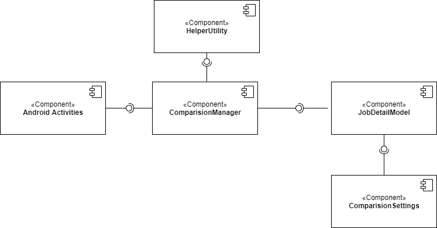
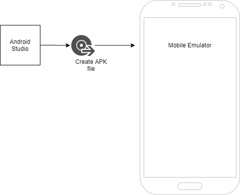
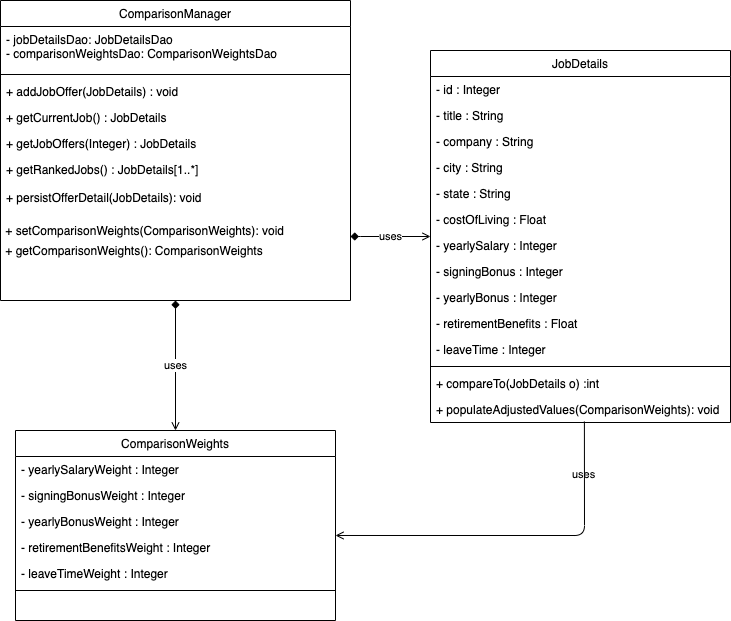
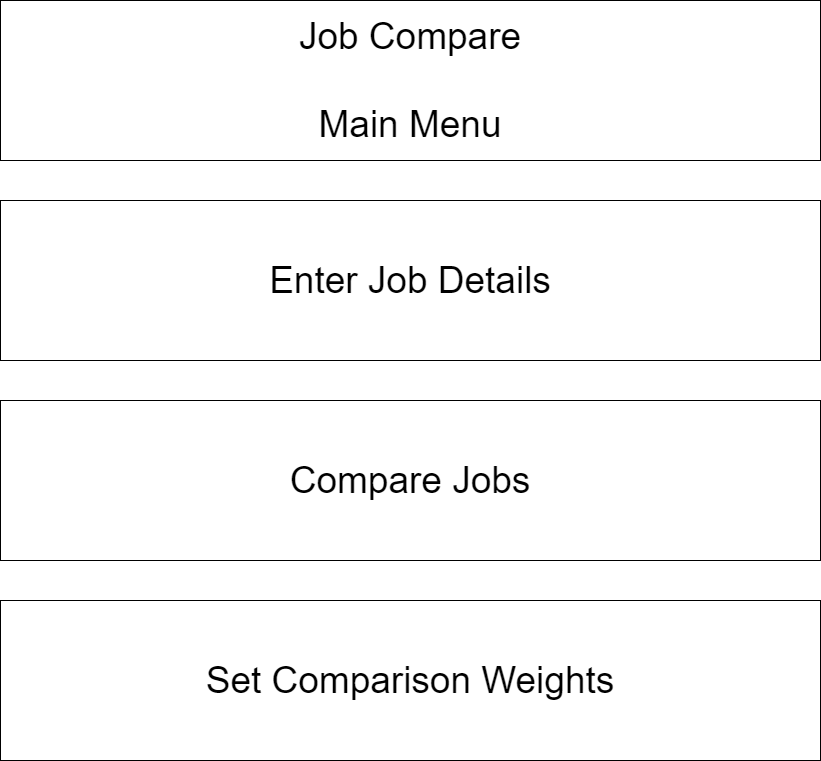
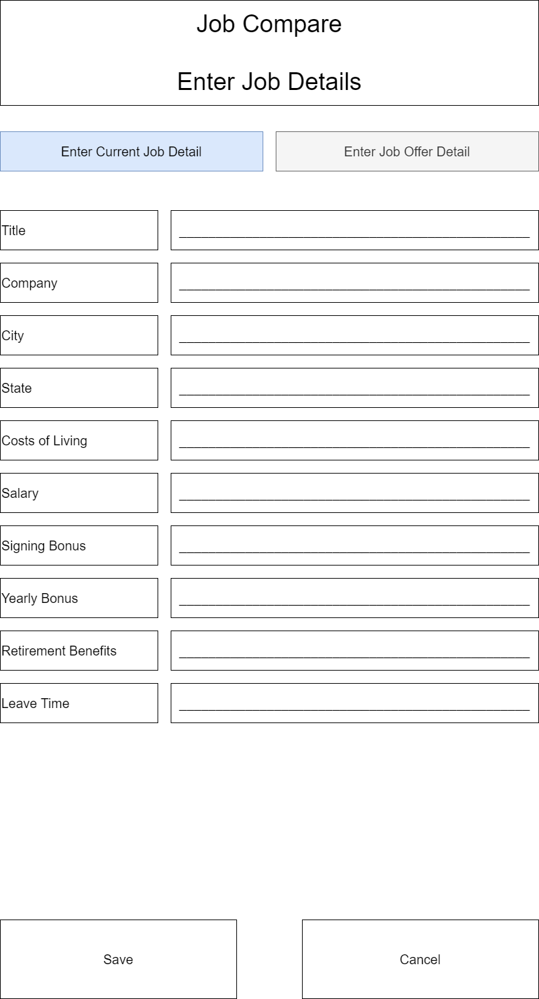
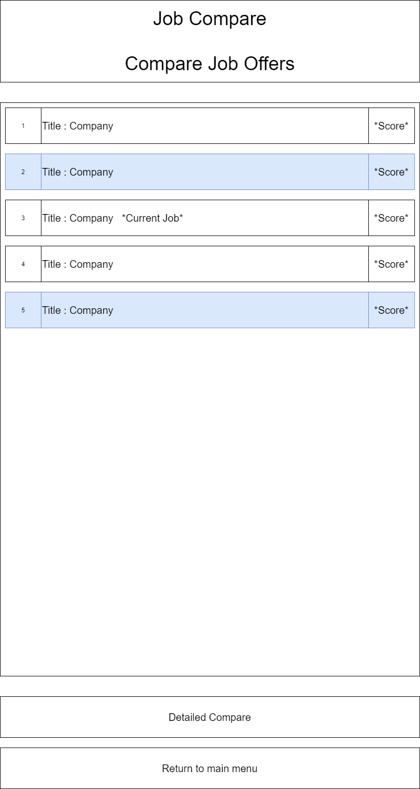
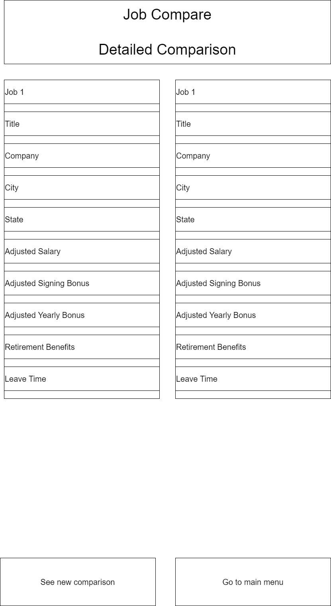
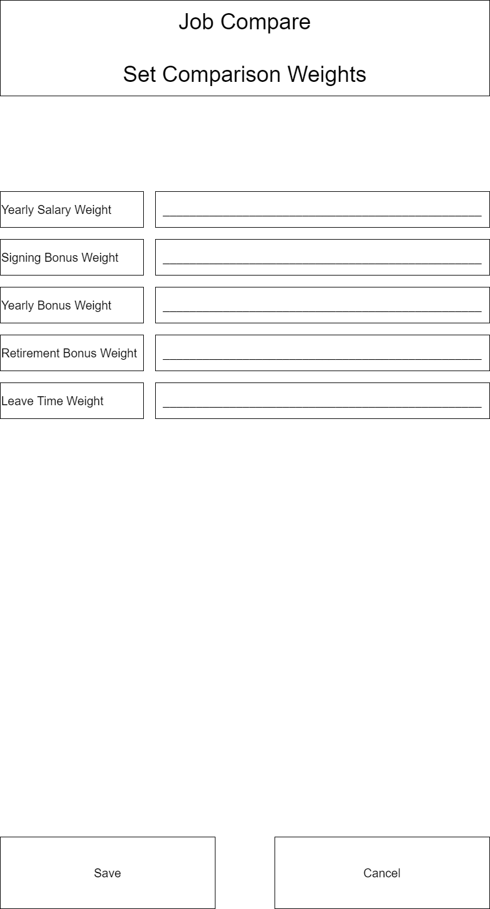

# Design Document

**Author**: Team35

## 1 Design Considerations

### 1.1 Assumptions

- Application is designed for single-user job offer comparision.
- Application is designed to run on Android devices

### 1.2 Constraints

- Application will not use any database, it will use the application memory to persist the data.
- Application will not use any user data and will not access any user database on device.
- Application will not use any third party API to access any kind of data.
- Application will not use device network.

### 1.3 System Environment

Hardware
* Any mobile device with input screen

Software
* Android OS

## 2 Architectural Design

### 2.1 Component Diagram
- Android Activities - This component consist of Android SDK classes.
- ComparisionManager - This is an interface to add and update the offer details
- JobDetailModel     - This provides an interface to update and do opretions on the offer details.
- HelperUtility - This is an interface contaning the helper fuction for calculation and tranformation on data.

### 2.2 Deployment Diagram

## 3 Low-Level Design

### 3.1 Class Diagram

### 3.2 Other Diagrams

NA

## 4 User Interface Design

### Main Menu

### Enter Job Details

### Compare Job Offers

### Detailed Comparison

### Set Comparison Weights

<!--stackedit_data:
eyJoaXN0b3J5IjpbMTYyODQ5NTM1MF19
-->
