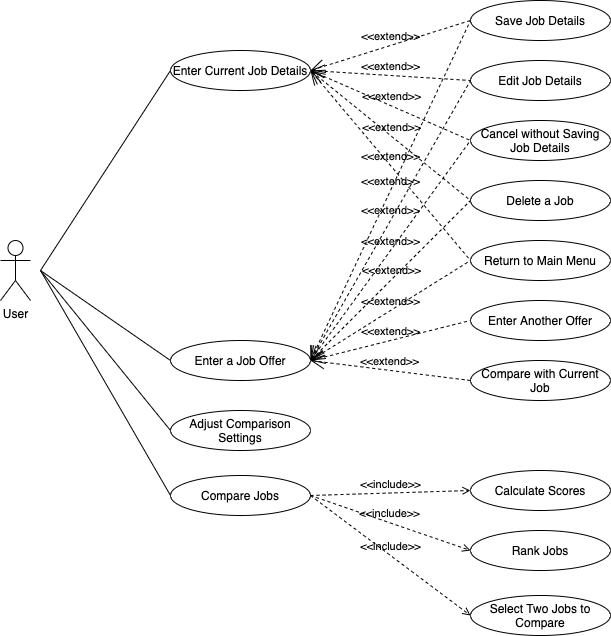

# Use Case Model

**Author**: Team 35

## 1 Use Case Diagram

## 2 Use Case Descriptions

- **Enter Current Job Details**
    - *Requirements: In order to compare job offers with the current job, a user should be able to enter current job details.*
    - *Pre-conditions: The user currently has a job.*
    - *Post-conditions: At the end of the use case, the current job details are entered.*
    - *Scenario: The user enters the current job details*
        - *Given I currently have a job*
        - *When I click the enter current job details button*
        - *Then I should be able to enter current job details*
- **Enter a Job Offer**
    - *Requirements: In order to compare job offers, a user should be able to enter a job offer.*
    - *Pre-conditions: The user currently has a job offer.*
    - *Post-conditions: At the end of the use case, the job offer details are entered.*
    - *Scenario: The user enters a job offer*
        - *Given I have a job offer*
        - *When I click the enter a job offer button*
        - *Then I should be able to enter job offer details*
- **Save Job Details**
    - *Requirements: In order to compare jobs, a user should be able to save job details.*
    - *Pre-conditions: The user have entered details for a job.*
    - *Post-conditions: At the end of the use case, the job details are saved.*
    - *Scenario 1: The user saves the current job details*
        - *Given I entered details for my current job*
        - *And the details are complete*
        - *When I click the save job details button*
        - *Then I should be able to save the current job details*
    - *Scenario 2: The user saves a job offer details*
        - *Given I entered details for a job offer*
        - *And the job offer is not yet in the system*
        - *And the details are complete*
        - *When I click the save job details button*
        - *Then I should be able to save the job offer details*
     - *Scenario 3: The user gets a warning saying the job details are incomplete*
        - *Given I entered details for a job*
        - *And the details are incomplete*
        - *When I click the save job details button*
        - *Then I should be given a warning saying the job details are incomplete*   
     - *Scenario 4: The user gets a warning saying the job already exists*
        - *Given I entered details for a job*
        - *And the details are complete*
        - *And the job offer is already in the system*
        - *When I click the save job details button*
        - *Then I should be given a warning saying the job already exists*   
- **Edit Job Details**
    - *Requirements: In order to allow corrections, a user should be able to edit job details.*
    - *Pre-conditions: The user has saved details for a job.*
    - *Post-conditions: At the end of the use case, the job details are updated.*
    - *Scenario 1: The user edits the current job details*
        - *Given I saved details for my current job*
        - *When I click the edit job details button*
        - *Then I should be able to edit the current job details and update*
    - *Scenario 2: The user edits the details for a job offer*
        - *Given I saved details for a job offer*
        - *When I click the edit job details button*
        - *Then I should be able to edit the job offer details and update*
- **Cancel without Saving Job Details**
    - *Requirements: In order to skip changes, a user should be able to cancel and exit without saving job details.*
    - *Pre-conditions: The user have entered details for a job.*
    - *Post-conditions: At the end of the use case, the job details are not updated.*
    - *Scenario 1: The user cancels without saving when entering details for a job*
        - *Given I entered details for a job*
        - *And the job details were not in the system*
        - *When I click the cancel button*
        - *Then I should be able to cancel without saving the entered job details*
    - *Scenario 2: The user cancels without saving when editing details for a job*
        - *Given I edited details for a job*
        - *And the job details were saved in the system before editing*
        - *When I click the cancel button*
        - *Then I should be able to cancel without saving the changes but saving the original details*
- **Delete a Job**
    - *Requirements: In order to clean up jobs in the system, a user should be able to delete a job.*
    - *Pre-conditions: The user has entered at least one job in the system.*
    - *Post-conditions: At the end of the use case, a job is deleted from the system.*
    - *Scenario 1: The user deletes the current job*
        - *Given I have saved the current job in the system*
        - *When I click delete button*
        - *Then I should be able to delete the current job*
    - *Scenario 2: The user deletes a job offer*
        - *Given I have saved at least one job offer in the system*
        - *When I click delete button*
        - *Then I should be able to delete the selected job*
- **Return to Main Menu**
    - *Requirements: In order to initiate a new action, a user should be able to return to the main menu.*
    - *Pre-conditions: The user is on the entering job detail page.*
    - *Post-conditions: At the end of the use case, the user is returned to the main menu.*
    - *Scenario 1: The user returns to the main menu after saving, or cancel without saving the current job*
        - *Given I am on the page to enter the current job descriptions*
        - *When I click the return to main menu button*
        - *Then I should be able to return to the main menu*
    - *Scenario 2: The user returns to the main menu after saving, or cancel without saving a job offer*
        - *Given I am on the page to enter a job offer*
        - *When I click the return to main menu button*
        - *Then I should be able to return to the main menu*
- **Enter Another Offer**
    - *Requirements: In order to continue adding job offers, a user should be able to enter another job offer after they are done with a previous one.*
    - *Pre-conditions: The user has entered one job offer.*
    - *Post-conditions: At the end of the use case, a second job offer is entered.*
    - *Scenario 1: The user enters another job offer after the first one is complete*
        - *Given I have entered all descriptions for one job offer*
        - *And I have another job offer to enter*
        - *When I click the enter another offer button*
        - *Then I should be able to enter details for another job offer*
    - *Scenario 2: The user enters another job offer when the first one is incomplete*
        - *Given I have entered one job offer but the descriptions are incomplete*
        - *And I have another job offer to enter*
        - *When I click the enter another offer button*
        - *Then I should be given a warning saying the current job offer has not been completed yet*
- **Compare with Current Job**
    - *Requirements: In order to decide to accept or decline a job offer, a user should be able to compare it with the current job.*
    - *Pre-conditions: The user has entered the current job.*
    - *Post-conditions: At the end of the use case, a job offer is compared with the current job.*
    - *Scenario 1: The user compares the job offer with the current job if present*
        - *Given I have a job offer entered*
        - *And I have a current job saved in the system*
        - *When I click the compare with current job button*
        - *Then I should be able to compare the job offer with the current job*
- **Adjust Comparison Settings**
    - *Requirements: In order to meet different comparison needs, a user should be able to adjust comparison settings.*
    - *Pre-conditions: The user has decided what weights to give to different attributes.*
    - *Post-conditions: At the end of the use case, the comparison settings are adjusted and new weights are saved.*
    - *Scenario 1: The user enters weights when weights do not exist*
        - *Given I have a decided the weights given to different attributes*
        - *When I click the adjust comparison settings button*
        - *Then I should be able to enter weights, save and return to the main menu*
    - *Scenario 1: The user changes existing weights*
        - *Given I have a decided the weights given to different attributes*
        - *When I click the adjust comparison settings button*
        - *Then I should be able to change existing weights, save and return to the main menu*
- **Compare Jobs**
    - *Requirements: In order to decide to accept or decline an offer, a user should be able to compare jobs.*
    - *Pre-conditions: The user has entered at least two jobs (may include the current job) to compare.*
    - *Post-conditions: At the end of the use case, a table comparing two jobs is displayed.*
    - *Scenario 1: The user compares a job offer with the current job*
        - *Given I have entered the current job*
        - *And I have entered at least a job offer*
        - *When I click the compare jobs button*
        - *Then I should be able to be shown a list of ranked job offers, select the current job and a job offer, and see a comparison table*
    - *Scenario 2: The user compares a job offer with another job offer*
        - *Given I have entered at least two job offers*
        - *When I click the compare jobs button*
        - *Then I should be able to be shown a list of ranked job offers, select two job offers, and see a comparison table*

<!--stackedit_data:
eyJoaXN0b3J5IjpbLTE4MzQ2MjczNF19
-->